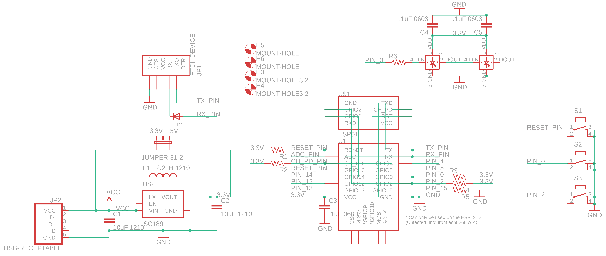
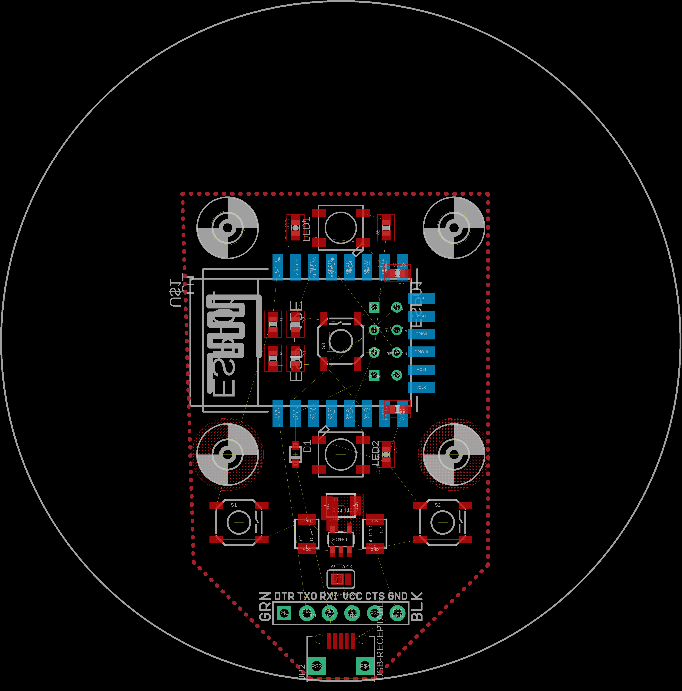

# internet-points-signal
A gadget that lets you know when your standing on the internet has been changed

I designed it mostly to play around in FreeCAD and puzzle out if there are any internet-based statuses that are worth notifying you of using a large green arrow.

